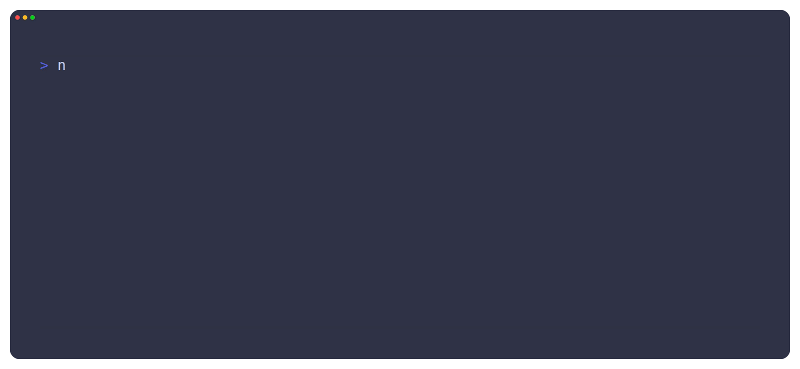

<div align="center">
  
  <h1>Latch</h1>

Latch is a TypeScript testing framework for running large-scale unit and integration tests on constrained systems.

  <a href="https://doi.org/10.1016/j.scico.2024.103157"></a>
  <a href="https://github.com/TOPLLab/latch/actions/workflows/test.yml"></a>
  <a href="https://github.com/TOPLLab/latch/actions/workflows/test.yml"></a>


<span>
    <a href="https://topllab.github.io/WARDuino/guide/latch.html">Documentation</a>
    <span> · </span>
    <a href="https://github.com/TOPLLab/WARDuino/actions/workflows/test.yml">Live example</a>  
</span>

</div>

<p align="center">
  
</p>

## Quick Start

```bash
git clone https://github.com/TOPLLab/latch.git
cd latch
npm install
npm run build
npm run test:example
```

## Development

Source code lives in `src/`, unit tests in `tests/unit/`, and executable
examples in `tests/examples/`. Useful commands are:

```bash
npm run build          # Compile the package
npm run test:all       # Build and run all tests
npm run test:example   # Run example (example.ts requires recursive submodules)
```

The repository uses a recursive WARDuino/WABT test fixture for hardware and
WebAssembly integration tests. Clone with submodules when working on those
tests:

```bash
git clone --recurse-submodules https://github.com/TOPLLab/latch.git
```

## Contributing

Bug reports, documentation improvements, and pull requests are welcome. For
larger changes, please [open an issue](https://github.com/TOPLLab/latch/issues)
first so the approach can be discussed. Before submitting a pull request,
run the build, tests, and linter locally and describe the user-visible change
in the pull request body.
